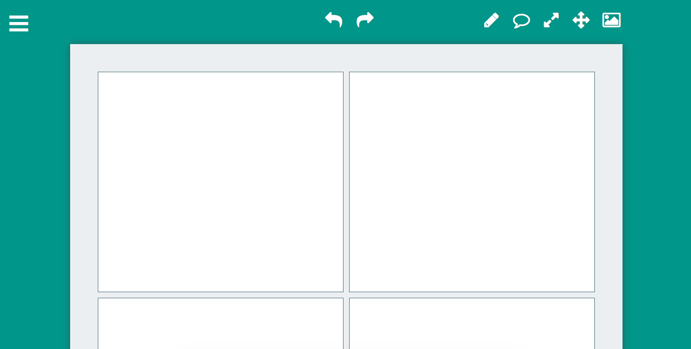

# Comic Book
#### ISP Assignment November 2014 - Université Paris-Sud
###### Leonardo Lanzinger

---

Comic Book is a sketch app that lets your draw simple sketches on a comic book pages. You can choose from a variety of comic book page templates with different numbers of panels and layouts. You can simply draw on the panel or upload a picture and place it on a panel, then you can enhance it drawing on top of it. It's also possible to add comic strips bubbles and place them in the panels. An undo manager allows user to undo or redo actions in the application.

## Usage
Open the file **index.html** in a web browser to start using the application. The software is compatible with any major browser and has been tested on a desktop and laptop environment. 
#### 1. Selecting the page template
Click on the top left menu icon and to **page templates** to enter the selection menu. Choosing a page template will reset the page to the new one.
#### 2. Drawing a free path on the panels
Click on the pen icon in the top toolbar to activate drawing mode. If drawing mode is activated the pen icon should also be underlined. Move your mouse on any panel and start drawing.
#### 3. Moving a panel
Click on the drag icon in the top toolbar to activate dragging mode. Once activated the icon should be underlined and you will be able to move around panels.
#### 4. Adding images
Click on the "add image" icon in the top toolbar to activate image insertion mode. Once activated, the icon should also be underlined, you can click on any panel to insert an image there. A popup file selection interface will appear, and from there you can select which image to insert in the panel.

**IMPORTANT:** only use images placed in the **graphics/img** folder inside the application folder, otherwise the app won't recognize them. Before uploading from the application you should copy the files in this directory!

#### 5. Adding speech bubbles
Click on "add bubble" icon in the top toolbar to insert a speech bubble in the page. The speech bubble can be moved and also resized.
#### 6. Resize objects
Click on the resize icon in the top toolbar to enable resizing.

**IMPORTANT:** at this moment the application only supports resizing of speech bubbles and images.

#### 7. Undo / Redo
The user can undo or redo his actions by clicking on the top center undo tool bar. Clicking on the left arrow will result in an undo action, clicking on the right arrow will result in a redo action.

**IMPORTANT:** at this moment the undo manager only works with drawing.

## Documentation

Class documentation built with JSDoc is available at **jsdoc/index.html**. 
Github repository of this project can be found at [**https://github.com/leolanzinger/comicbook**](https://github.com/leolanzinger/comicbook).

## Credits

- **JQuery**: [**https://github.com/jquery/jquery**](https://github.com/jquery/jquery)
- **JQuery UI**: [**https://github.com/jquery/jquery-ui**](https://github.com/jquery/jquery-ui) - drag and resize methods
- **Javascript UndoManager**: [**https://github.com/ArthurClemens/Javascript-Undo-Manager**](https://github.com/ArthurClemens/Javascript-Undo-Manager) - manage undo and redo function callbacks [not the actual undo and redo functions]
- **JQuery MMenu**: [**http://mmenu.frebsite.nl**](http://mmenu.frebsite.nl) - sliding lateral menu
- **JsDoc**: [**https://github.com/jsdoc3/jsdoc**](https://github.com/jsdoc3/jsdoc) - used to compile documentation
- **Fontello**: [**http://fontello.com**](http://fontello.com) - icons
- **Google Fonts**: [**http://www.google.com/fonts**](http://www.google.com/fonts) - fonts
